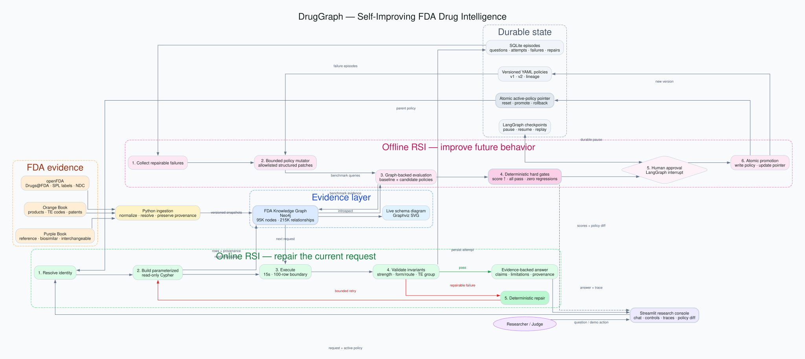

<!-- _class: compact -->

# 1. Complex research agents depend on retrieval

## RAG fetches the enterprise domain knowledge an agent needs to reason

- Foundation models do not contain every organization’s **current, private, or regulated evidence**.
- RAG is the agent’s evidence supply chain: it selects what enters the reasoning context.
- Poor retrieval creates confident conclusions from missing, stale, or incorrectly grouped evidence.
- In drug research, **product, strength, route, dosage form, and regulatory status** all matter.

> **If retrieval is wrong, better generation cannot rescue the answer.**

**Goal:** make enterprise retrieval observable, testable, and self-improving.

<!--
Talk track: Complex research agents rely on RAG to fetch enterprise knowledge before reasoning begins. That makes retrieval quality a system-level safety and performance concern, not just a search feature.
-->

---

<!-- _class: compact -->

# 2. FDA Knowledge Graph

## Unifying fragmented regulatory evidence for precise retrieval

| Source | Evidence |
|---|---|
| **Orange Book** | Products, applications, RLD/RS status, TE codes, patents |
| **Purple Book** | Reference biologics, biosimilars, interchangeable products |
| **openFDA** | Drugs@FDA, SPL labels, and NDC listings |

### The graph connects

**Drug names → products → applications → regulatory evidence → labels**

- Approximately **95K nodes** and **215K relationships**
- Provenance remains attached to every claim
- State substitution law remains a separate, versioned source

<!--
Talk track: These datasets answer different regulatory questions. A graph preserves their relationships and provenance instead of flattening everything into one misleading table.
-->

---

<!-- _class: compact -->

# 3. DrugGraph system design



- **Neo4j:** FDA evidence and provenance
- **LangGraph:** online repair and offline optimization
- **SQLite + YAML:** durable episodes, checkpoints, policy lineage, and rollback

<!--
Talk track: The online loop repairs the current request. The offline loop learns a durable policy improvement. Keeping those loops separate prevents an untested repair from becoming production behavior.
-->

---

<!-- _class: compact -->

# 4. Self-improving retrieval—not self-modifying code

```text
Detect failure → Repair request → Record episode
       ↓
Generate bounded policies → Run graph-backed evals
       ↓
Hard safety gates → Human approval → Promote → Replay
```

### Demonstrated policy evolution

| | Policy v1 | Promoted v2 |
|---|---:|---:|
| Evaluation score | **37.5%** | **100%** |
| Lipitor query attempts | **2** | **1** |
| Adalimumab capability | Blocked | Enabled after Purple Book gate |

**Promotion rule:** higher score + all hard checks + zero regressions + approval. Every mutation is allowlisted and shown as a YAML diff.

<!--
Talk track: This is bounded hill-climbing over retrieval policy, not model training. The optimizer cannot rewrite Python or invent arbitrary Cypher.
-->

---

<!-- _class: compact -->

# 5. What worked—and what comes next

## What worked

- Deterministic FDA invariants caught errors that an LLM judge might miss.
- Graph-backed evaluation made policy improvement measurable.
- Approval, versioning, reset, and rollback made the loop demoable and auditable.

## Next

- Add an **LLM judge** for usefulness and clarity—never as the sole promotion gate.
- Add an LLM proposer that emits only structured, allowlisted policy patches.
- Evaluate on frozen FDA graph snapshots and shadow production traffic.
- Expand RSI to label monitoring, biologic navigation, and sourced state-law rules.

> **DrugGraph turns retrieval failures into tested, durable improvements.**

<!--
Close: The contribution is not another chatbot. It is a controlled mechanism for making regulated-data retrieval improve without surrendering safety or auditability.
-->
